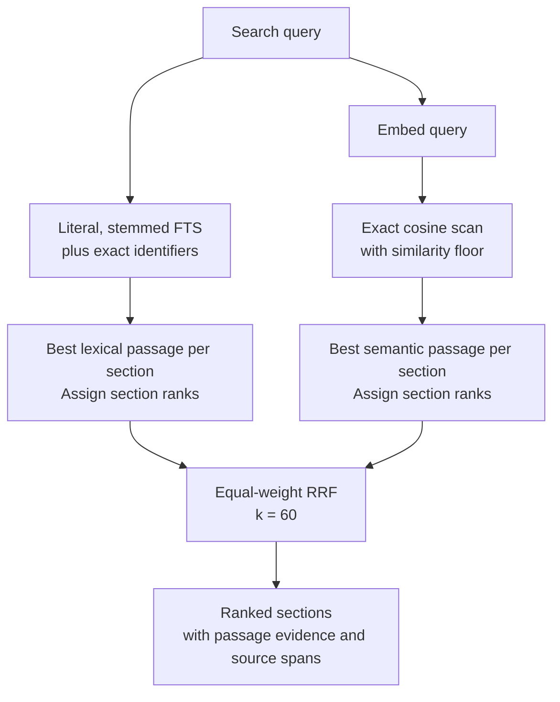
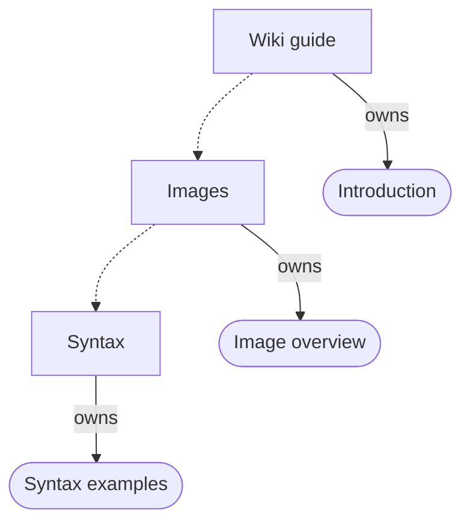
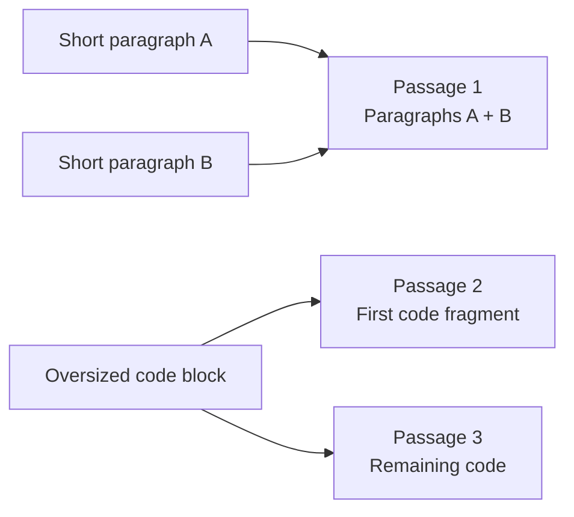
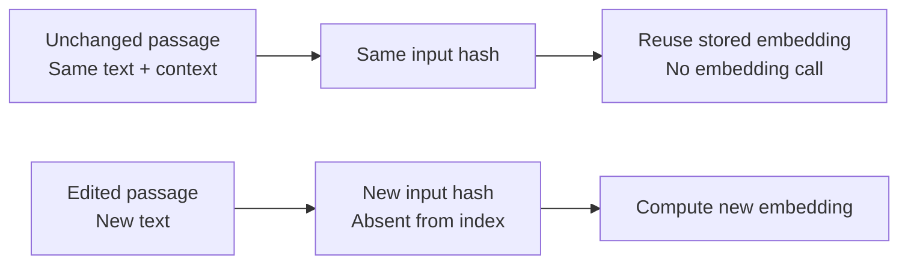
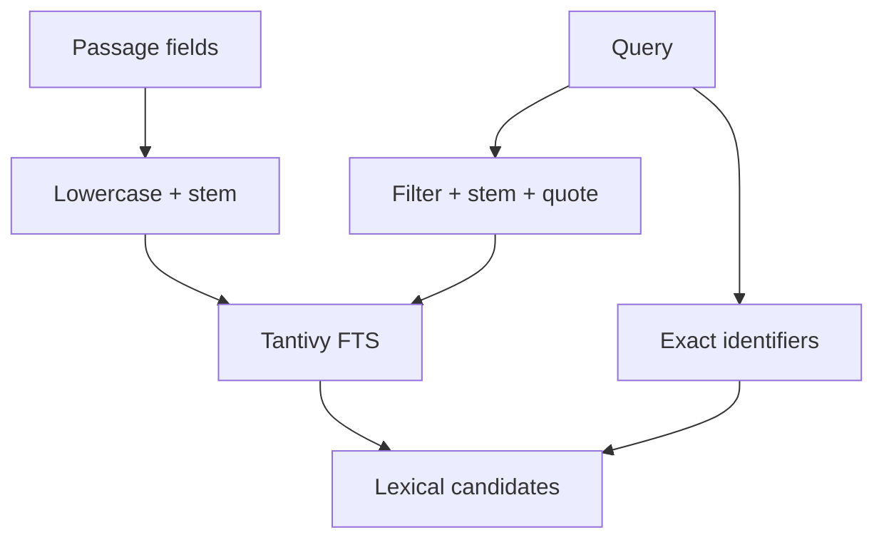

# RAG Architecture

Lat retrieves sections through owned passages, English-stemmed full-text search, and embedding similarity. This page is the implementation reference; [[cli#search]] documents command usage and [[tests/search]] defines the test contracts.

## Retrieval pipeline

Search embeds the query, retrieves lexical and semantic passage candidates, collapses each channel to sections, and combines their ranks. Results carry the original matching passages and source locations.

[[src/search/search.ts#searchSections]] runs the pipeline. [[src/cli/search.ts]] coordinates indexing for writable search; [[src/search/query.ts#openIndexedSearchSession]] provides reusable indexed sessions. [[src/view/preindexed-search.ts]] serves exported sites from a finished index.

See [[rag-architecture#Candidate retrieval and fusion]] for the RRF formula, worked examples, and candidate selection rules.

## Coverage and ownership

Each Markdown body block belongs to its deepest containing section. Parents store their own passages and parent relationships, without duplicating descendant bodies in ancestor embeddings.

For example, a wiki guide can contain an Images section with a nested Syntax section. Dashed arrows below show section containment; solid arrows show passage ownership.

The syntax examples are embedded as passages owned by Syntax. Their embedding inputs include bounded heading context such as “Wiki guide / Images / Syntax”, but their body text is not also embedded under Images or Wiki guide. A match on those examples returns Syntax; the parent relationship alone does not create a result for Images or Wiki guide.

[[src/markdown-analysis.ts]] records block structure and source offsets. [[src/search/chunks.ts#chunkFile]] skips headings and YAML during body assignment, walks section ranges, and associates blocks with their owners. A section with no body gets a heading passage so it remains searchable.

Passages retain their owner, ordinal, block type, original text, offsets, and line ranges. Embedding context is separate from source text. Stored section rows contain identity, file, heading, introduction, content hash, parent, and line range; [[src/search/index.ts#indexSections]] writes these records.

The introduction is ordinary passage evidence, not a separate summary vector. Parent pointers describe containment but do not promote parents or boost descendants during ranking. Coverage and ownership are exercised by [[tests/search#Hybrid Retrieval#Preserves complete passage coverage]] in [[tests/hybrid-search.test.ts]].

## Chunk boundaries

Chunking preserves blocks that fit, splits oversized blocks using their available structure, and packs adjacent pieces from one section. Every assembled input is checked against the embedding model's token limit.

[[src/search/chunks.ts#chunkFile]] targets 192 body tokens and 48 context tokens for local embeddings, or 512 and 96 for hosted embeddings. These are packing targets, not fixed chunk lengths. Context includes the section heading, page heading, and ancestor heading path; it is shortened to fit its budget and the complete input limit.

This example shows consecutive blocks in one section. Paragraphs A and B fit together, so they share passage 1. The code block is too large and splits into passages 2 and 3. Each passage receives bounded heading context; the diagram shows only its source text. Each fit check includes contextual input, and a source unit that cannot fit raises an error rather than being truncated.

Oversized blocks follow the actual parsed structure:

- Blocks with children split recursively. Lists split through items and child blocks; tables split through rows and cells. Bounded labels carry list-item text, table headers, row indices, or column indices.
- Leaf blocks start with a fitting text prefix. Code prefers a nearby newline; other text prefers a nearby sentence boundary. A nearby whitespace boundary is the next preference.
- Unbroken or still-oversized text uses a prefix that fits without splitting a UTF-16 surrogate pair. Code fragments retain a bounded language label. Fragments need not be independently valid Markdown or compilable code.

[[src/search/chunks.ts#fittingPrefix]] repeatedly halves the candidate prefix until it fits; it does not assume token counts are monotonic or find the largest possible prefix. Preferred boundaries are used only when sufficiently near the end of that prefix and still within budget. Failure to fit any nonempty source unit raises an error.

Adjacent pieces merge only when neither needs extra structural labels, their intervening source is whitespace, and their combined input fits. There is no overlap. Original spans remain available for citations and previews regardless of contextual labels.

Tests: [[tests/search#Hybrid Retrieval#Preserves complete passage coverage]] covers oversized blocks and source preservation; [[tests/search#Hybrid Retrieval#Rejects local embedding truncation]] verifies the actual local tokenizer and overflow rejection.

## Embedding backends

The embedder contract exposes dimensions, model input limits, tokenizer identity, token counting, and vector generation. Both indexing and querying reject oversized input rather than silently truncating it.

[[packages/embed/src/index.ts#createEmbedder]] selects the local or hosted backend. [[src/search/embedder.ts#embedderForIndex]] honors an existing index's recorded model; fresh indexes honor the durable local preference before consulting configured credentials.

[[packages/embed/src/local.ts#createLocalEmbedder]] loads MiniLM from [[packages/embed-minilm-fp16]] into a Rust/WASM engine. [[packages/embed/crate/src/lib.rs#Embedder]] counts tokens including special tokens, rejects overflow, and generates normalized embeddings. Large batches use [[packages/embed/src/worker.ts]]; small batches run inline.

[[packages/embed/src/remote.ts]] counts hosted inputs with `js-tiktoken`, batches OpenAI-compatible requests, and validates response ordering. [[tests/search#Hybrid Retrieval#Validates hosted input and response ordering]] uses mocked responses; it is not a live hosted relevance evaluation.

## Embedding reuse after edits

Embedding reuse is keyed by the complete contextual input and embedding fingerprint. A small edit only needs vectors for inputs whose hashes are absent from the active index.

[[src/search/chunks.ts#embeddingFingerprint]] includes chunk policy, model name, dimensions, input limit, and tokenizer fingerprint. The SHA-256 input hash also includes the assembled context and passage text. Offsets and passage ordinals do not determine vector identity; different contexts can prevent identical body text from sharing a vector.

[[src/search/index.ts#indexSections]] deduplicates missing hashes before embedding and validates vector counts, dimensions, and finite values before database mutation. Changed sections have their passage metadata replaced, while unchanged input hashes retain their vectors. Unreferenced vectors are removed, so this is an active-index cache rather than permanent storage for historical text.

[[src/cli/search.ts]] skips indexing when project, embedding, and lexical fingerprints match. When source changes, indexing chunks the analyzed project again; it does not yet cache each file's chunk layout. Offset-only edits can rewrite metadata without embedding again. Packing changes can shift later chunks, and heading edits can change contextual inputs. Explicit [[cli#reindex]] starts an empty generation and regenerates vectors.

Growing one paragraph can change how the rest of its section packs into passages. The indexer rebuilds the complete passage layout before comparing hashes, so every affected downstream input is embedded if its hash is missing. An unchanged input can reuse its vector even when its ordinal or source location moves.

For a changed section, all passage rows, lexical entries, and exact identifiers are replaced from the new layout. Obsolete passages disappear, and vectors no longer referenced by any passage are removed. Embedding reuse saves vector computation; it does not preserve outdated chunk boundaries.

Tests: [[tests/search#Hybrid Retrieval#Reuses vectors after source movement]] and [[tests/search#Hybrid Retrieval#Rejects invalid vectors before changing the index]], implemented in [[tests/hybrid-search.test.ts]].

The example below assumes an edit leaves the other passage boundaries and heading context unchanged. Only the edited passage needs a new embedding when its new hash is absent; both passages retain current source locations in the index.

## Lexical analysis

Full-text search indexes normalized passage body, heading, and ancestor path in separate fields. Original passage text remains the source for embeddings, previews, and citations.

[[src/search/lexical.ts#lexicalTokens]] lowercases Unicode word tokens and stems ASCII English words with [[packages/stemmer]]. Other word tokens remain unstemmed. [[src/search/lexical.ts#synchronizeLexical]] maintains derived `lexical_chunks` rows and a lexical-policy version independent of vector fingerprints.

[[src/search/db.ts#CREATE_PASSAGE_FTS]] uses Turso's Tantivy FTS with whitespace tokenization and weights of body 1, heading 2, and path 0.5. Whitespace tokenization preserves the stems emitted by the application. This implements English word-form normalization, not synonym expansion or language detection.

[[src/search/search.ts#literalFtsQuery]] removes a fixed set of common English query words, stems remaining tokens, quotes them, and joins them with OR. User text does not execute arbitrary FTS syntax. [[src/search/index.ts#identifierTokens]] separately records punctuation-bearing identifiers and long tokens; the exact route matches the entire lowercased, trimmed query and precedes ordinary lexical hits.

Tests: [[tests/search#Hybrid Retrieval#Stems English lexical fields and queries]], [[tests/search#Hybrid Retrieval#Upgrades lexical indexes without embedding again]], and [[tests/search#Hybrid Retrieval#Retrieves lexical evidence independently]].

## Candidate retrieval and fusion

Each channel contributes its best passage per section. The ranker uses equal-weight reciprocal rank fusion with a fixed constant of 60; it does not sum or average all passage scores.

[[src/search/search.ts#searchSections]] performs an exact cosine scan over stored embeddings and a separate FTS score query. Semantic candidates require similarity at least 0.20 by default; positive lexical matches and exact identifiers remain eligible independently. The cosine floor is not a threshold on the fused score.

For a requested result limit `L`, each channel targets `max(50, L)` distinct owners. Retrieval starts at twice that many passages and doubles up to ten times the target. It stops on sufficient owners, exhausted rows, scores below the channel threshold, or the cap. Exact-identifier lookup has the same cap. Returned diagnostics report passage candidate counts and cap exhaustion.

[[src/search/search.ts#collapse]] retains the first candidate per section after sorting by exact-match priority, score, section ID, and passage ID. Equal scores with the same exact-match status share dense ranks. Stable identifiers order retained ties, although bounded SQL selection can still cut through a tied group.

**Reciprocal rank fusion (RRF)** combines the two ordered result lists using each section's position in each list. Lexical scores and cosine similarities have different scales, so Lat combines ranks rather than adding their raw scores. Each channel first collapses passages to sections; rank 1 is best, and tied channel scores share a rank.

For a section $s$, the implemented hybrid score is:

$$
\operatorname{RRF}(s) = \sum_{c \in \{\text{lexical},\text{semantic}\}} \begin{cases}
\dfrac{1}{60 + r_c(s)} & \text{if } s \text{ appears in channel } c, \\
0 & \text{otherwise.}
\end{cases}
$$

Here $r_c(s)$ is the section's rank in that channel's retrieved candidates. Both channels have equal weight. The constant 60 softens the advantage of the first few positions: rank 1 contributes about 0.01639, while rank 10 contributes about 0.01429. Agreement between channels therefore matters more than a small difference in position.

| Lexical rank | Semantic rank | Hybrid score |
| --- | --- | --- |
| 1 | 1 | 0.03279 |
| 10 | 10 | 0.02857 |
| 1 | Absent | 0.01639 |

Results sort by descending hybrid score. In this example, a section ranked tenth by both channels outranks one ranked first only lexically. The score is a ranking signal, not a confidence percentage; its maximum is $2/61 \approx 0.03279$. RRF ignores raw score margins and treats a channel's missing candidate as zero evidence, so candidate selection affects the final ordering.

Final ties use section ID. Maximum-passage aggregation avoids dilution from unrelated passages, but longer sections still have more opportunities to produce a high-scoring passage.

Tests: [[tests/search#Hybrid Retrieval#Collapses before rank fusion]] and [[tests/search#Hybrid Retrieval#Overfetches toward unique sections]].

## Storage and migration

The index uses embedded `@tursodatabase/database` 0.7.2. Checkpointed database generations are published through a manifest, so unsuccessful updates do not replace an existing usable index.

[[src/search/db.ts#SearchDb]] adapts SQL access. The schema separates `sections`, `chunks`, `embeddings`, `lexical_chunks`, `identifiers`, and `meta`. Vectors are stored as `vector32`; retrieval uses an exact scan rather than an approximate vector index. FTS uses the exact indexed columns in a score-only query with ORDER BY and LIMIT; fusion and result hydration happen in application code.

[[src/search/cache.ts#writeIndex]] serializes writers with a process-owned lock, copies the active generation for incremental work, checkpoints the result, and atomically replaces `search-index.json`. Staging uses single-process access; published database opens enable experimental multiprocess WAL on Unix. Windows uses the supported default WAL mode. Windows search and publication metadata readers open private temporary copies of checkpointed generations. FTS requires writable handles, so copying avoids exclusive locks on the published file. Writers mutate staging files rather than checkpointing the active generation; readers keep their original snapshot until closed.

Unchanged work discards its staging copy. Failed work removes staging files and preserves the manifest. Prior published generations remain available for existing readers; automatic generation cleanup is not implemented.

Legacy `vectors.db` is inspected and checkpointed in a short-lived libSQL process so native handles are released before Windows renames the file and archived as `vectors.db.old-12`, with numbered suffixes on collision. Migration metadata retains its model across interrupted attempts. Indexing-capable search rebuilds the new format; hooks do not perform migration. Embedding-policy changes require explicit reindexing, while lexical-policy upgrades reuse stored vectors.

Initial indexing, batches with more than 512 changed passages, and every replacement or deletion rebuild FTS transactionally after row changes. This removes historical document statistics from BM25; small addition-only batches maintain the index incrementally. The live-statistics lexical version repairs older indexes without regenerating embeddings. [[src/search/lexical.ts#synchronizeLexical]] rebuilds normalized rows and FTS when the lexical version changes.

Tests: [[tests/search#Hybrid Retrieval#Publishes only successful generations]], [[tests/search#Hybrid Retrieval#Preserves FTS rollback and portable copies]], [[tests/search#Hybrid Retrieval#Archives legacy caches without overwriting backups]], and [[tests/search#Hybrid Retrieval#Keeps readers alive across process boundaries]].

## Result contract

Search returns sections with fused rank scores, available channel scores and ranks, and source-linked passage evidence. A hybrid score is neither cosine similarity nor calibrated confidence.

[[src/search/types.ts]] defines `SearchResult`, `SearchEvidence`, and diagnostics. Each result contains up to one best passage per channel; a passage selected by both channels appears once. [[src/search/query.ts#resolveSearchMatches]] resolves indexed IDs against the analyzed section map and omits IDs absent from that snapshot.

[[src/format.ts]] renders CLI/MCP passage previews, introductions, or both. [[src/view/protocol.ts]] carries the browser response. Preview selection does not change ranking; [[tests/search#Hybrid Retrieval#Switches preview without changing relevance]] verifies this contract. [[tests/search#RAG Tests#Reuses an indexed search session]] covers database and embedder reuse.

## Exported site search

A site export packages a finished index and a search server. Runtime search copies the checkpointed database into writable temporary storage rather than indexing the vault on each request.

[[src/view/server-build.ts]] exports sections and generates the server entrypoint; [[src/view/server-index-worker.ts]] builds the index in a child process. [[src/view/server-deployment.ts]] reads the manifest, prepares the temporary database, and serves the search route through [[src/view/preindexed-search.ts]].

[[scripts/prepare-site-packages.mjs]] hydrates published artifacts matching workspace package versions. The embedding JavaScript and WASM must be released together: `@lat.md/embed@0.2.1` supplies the token-counting API, and `@lat.md/stemmer@0.1.0` supplies lexical stemming. [[scripts/vendor-site-packages.mjs]] packages branch-local runtime code for the repository preview.

[[src/view/vercel-build.ts#buildVercelOutput]] explicitly includes the search manifest and the database named inside it. Static tracing cannot discover that dynamically selected filename. Missing files fail packaging before replacing an existing output; other runtime dependencies are traced into the function separately from CDN assets.

Tests: [[view/specs#Builds Vercel output directly]] in [[tests/vercel-build.test.ts]] and [[tests/search#Hybrid Retrieval#Packages stemmer runtime assets]] in [[tests/embed-assets.test.ts]].

## Evaluation and limits

The committed evaluation fixtures measure section retrieval and preserve the distinction between implemented ranking and experimental alternatives. They do not establish universal relevance quality.

[[tests/cases/hybrid/judgments.json]] retains 40 development and 20 held-out queries, including two parent-scope cases outside the implemented ranking scope. Synthetic benchmark results measure exact retrieval with precomputed vectors; their timing excludes embedding generation and Markdown chunking.

[[tests/cases/hybrid/evaluation-local.json]], [[tests/cases/hybrid/evaluation-stemmed.json]], and [[tests/cases/hybrid/benchmark-local.json]] retain their original measured snapshots. They are evidence, not current runtime settings. Benchmark and evaluation runners are not shipped in this repository; retained artifacts describe historical measurements, while the linked automated tests verify runtime behavior.

The runtime does not implement ancestor promotion, backlink authority, summary vectors, whole-section FTS, synonym dictionaries, candidate-union rescoring, learned reranking, or automatic neighboring-passage expansion. Hierarchy and source spans support section identity and evidence; they are not extra relevance votes.
