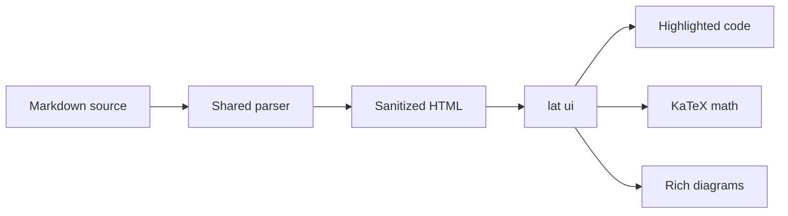

# Markdown Rendering Demo

This page is a visual smoke test for the GitHub-style and Lat-specific Markdown features rendered by `lat ui`.

Launch `lat ui`, choose **View → Demo** in the file tree, and compare each rendered example with its short description.

## Typography and Strikethrough

Ordinary CommonMark typography combines with GitHub strikethrough without special setup.

Text can be **bold**, _italic_, **_both_**, `inline code`, or ~~obsolete but still readable~~.

> A normal blockquote remains visually distinct from the GitHub alerts shown below.

## Tables

Pipe tables render as semantic tables, including inline Markdown and column alignment.

| Feature | Syntax sample | Status |
| :--- | :---: | ---: |
| Table | `\| cell \|` | **Rendered** |
| Strikethrough | `~~old~~` | ~~Old~~ New |
| Inline code | `` `const` `` | `const` |
| Emoji | `:rocket:` | :rocket: |

## Task Lists

Task-list markers become disabled checkboxes, preserving checked, unchecked, and nested states.

- [x] Render tables and inline formatting
- [x] Render checked tasks
- [ ] Leave an unchecked task visible
  - [x] Keep nested task alignment
  - [ ] Show another nested state

## Links and Autolinks

Bare web and email addresses become links, while explicit Markdown links keep their authored labels.

- Bare HTTPS URL: https://github.com/1st1/lat.md
- Bare `www` URL: www.example.com
- Bare email address: demo@example.com
- Explicit link: [GitHub Flavored Markdown specification](https://github.github.com/gfm/)

## Safe HTML

Allowed GitHub HTML survives sanitization, including disclosure widgets and semantic inline tags.

<details open>
<summary>Open this disclosure widget</summary>

The sanitizer keeps safe content such as H<sub>2</sub>O, x<sup>2</sup>, <kbd>⌘</kbd> + <kbd>K</kbd>, <samp>output</samp>, and <var>variables</var>.

</details>

## Alerts

All five GitHub alert kinds render as labeled callouts with their own semantic color.

> [!NOTE]
> Notes add useful context that readers can safely skim.

> [!TIP]
> Tips highlight a more effective way to complete a task.

> [!IMPORTANT]
> Important callouts identify information required for success.

> [!WARNING]
> Warnings flag urgent conditions that need attention.

> [!CAUTION]
> Cautions describe risks or negative outcomes.

## Footnotes

Footnote references jump to a compact notes section and provide return links back to the source text.

Lat keeps architecture close to the code.[^architecture] A second reference can explain why the demo exists.[^demo]

[^architecture]: The knowledge graph connects design intent, tests, and implementation through validated references.
[^demo]: This page provides a quick manual rendering check without replacing automated tests.

## Emoji Shortcodes

Standard emoji become accessible Unicode, GitHub-specific emoji use image assets, and unknown names remain literal.

Standard: :tada: :rocket: :+1: :eyes:

GitHub-specific: :shipit: :octocat:

Unknown and intentionally unchanged: :not-a-real-emoji:

## Syntax Highlighting

Supported fenced-code labels produce safe Lowlight syntax trees from selected Highlight.js grammars, with theme-aware colors applied by the browser.

```ts
type DemoState = {
  ready: boolean;
  features: string[];
};

const state: DemoState = {
  ready: true,
  features: ['tables', 'math', 'diagrams'],
};

console.log(`Rendering ${state.features.length} feature groups`);
```

```diff
- const renderer = 'plain text';
+ const renderer = 'GitHub-style Markdown';
```

```json
{
  "safe": true,
  "renderers": ["highlight.js", "KaTeX", "Mermaid"]
}
```

## Math

KaTeX renders inline math, display-dollar blocks, and fenced `math` blocks with accessible MathML.

Einstein's mass-energy relation is $E = mc^2$, and the quadratic formula is $x = \frac{-b \pm \sqrt{b^2 - 4ac}}{3a}$.

$$
\int_0^1 x^3 \, dx = \frac{1}{3}
$$

```math
\sum_{n=1}^{\infty} \frac{1}{2^n} = 1
```

## Rich Diagram Fences

GitHub diagram and data fences retain readable source as a fallback, then lazily become interactive browser renderers.

### Mermaid

Mermaid source becomes a strict-mode SVG flowchart after the document loads.



### GeoJSON

GeoJSON becomes an interactive OpenStreetMap view with pan, zoom, and automatic bounds around the supplied geometry.

```geojson
{
  "type": "FeatureCollection",
  "features": [
    {
      "type": "Feature",
      "properties": { "name": "San Francisco" },
      "geometry": {
        "type": "Point",
        "coordinates": [-122.4194, 37.7749]
      }
    },
    {
      "type": "Feature",
      "properties": { "name": "Demo area" },
      "geometry": {
        "type": "Polygon",
        "coordinates": [[
          [-122.48, 37.73],
          [-122.48, 37.81],
          [-122.36, 37.81],
          [-122.36, 37.73],
          [-122.48, 37.73]
        ]]
      }
    }
  ]
}
```

### TopoJSON

TopoJSON objects are converted to GeoJSON in the browser and overlaid on the same OpenFreeMap basemap.

```topojson
{
  "type": "Topology",
  "objects": {
    "demo": {
      "type": "GeometryCollection",
      "geometries": [
        {
          "type": "Point",
          "properties": { "name": "Center" },
          "coordinates": [-122.42, 37.77]
        },
        {
          "type": "LineString",
          "properties": { "name": "Route" },
          "arcs": [0]
        }
      ]
    }
  },
  "arcs": [
    [
      [-122.48, 37.74],
      [-122.43, 37.79],
      [-122.36, 37.76]
    ]
  ]
}
```

### ASCII STL

ASCII STL becomes an automatically framed WebGL model that supports drag-to-rotate, wheel zoom, and keyboard focus.

```stl
solid tetrahedron
  facet normal 0.0 -1.0 0.0
    outer loop
      vertex 0.0 0.0 0.0
      vertex 1.0 0.0 0.0
      vertex 0.0 0.0 1.0
    endloop
  endfacet
  facet normal 0.0 0.0 -1.0
    outer loop
      vertex 0.0 0.0 0.0
      vertex 0.0 1.0 0.0
      vertex 1.0 0.0 0.0
    endloop
  endfacet
  facet normal -1.0 0.0 0.0
    outer loop
      vertex 0.0 0.0 0.0
      vertex 0.0 0.0 1.0
      vertex 0.0 1.0 0.0
    endloop
  endfacet
  facet normal 0.577 0.577 0.577
    outer loop
      vertex 1.0 0.0 0.0
      vertex 0.0 1.0 0.0
      vertex 0.0 0.0 1.0
    endloop
  endfacet
endsolid tetrahedron
```

## GitHub Repository Boundaries

Conversation-only GitHub references stay literal in repository-style Lat documents, while full URLs remain ordinary external links.

- Issue references: #26, GH-26, and owner/repository#26
- Account mention: @octocat
- Commit SHA: a5c3785ed8d6a35868bc169f07e40e889087fd2e
- Full issue URL: https://github.com/jlord/sheetsee.js/issues/26

## Lat Links

Lat wiki links, aliases, source-code targets, and validated relative Markdown links remain navigable alongside GitHub Markdown.

- Wiki link: [[markdown#Tables]]
- Aliased wiki link: [[markdown#Math|the math rendering design]]
- Source-code link: [[src/view/markdown.ts#renderMarkdown]]
- Relative Markdown link: [browser architecture](architecture.md#browser-architecture)

---

If every section above looks structured and interactive, the complete Markdown rendering stack is working.
